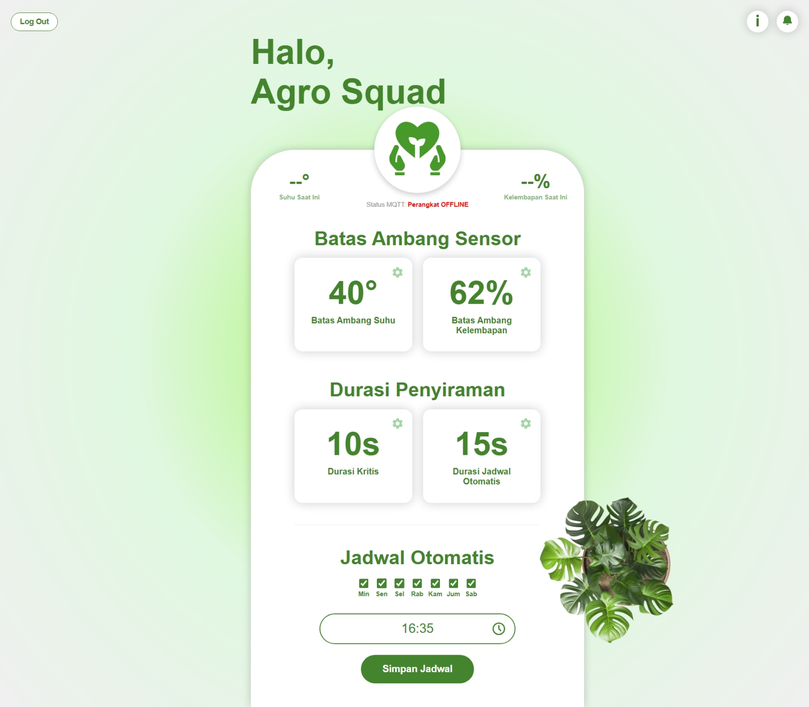
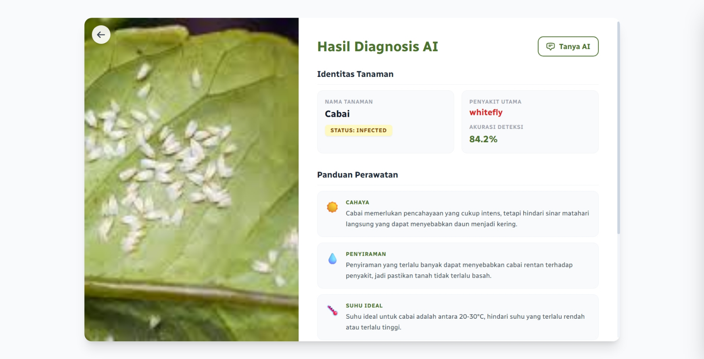
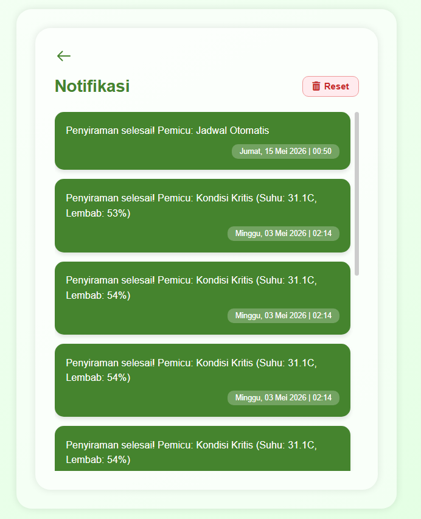
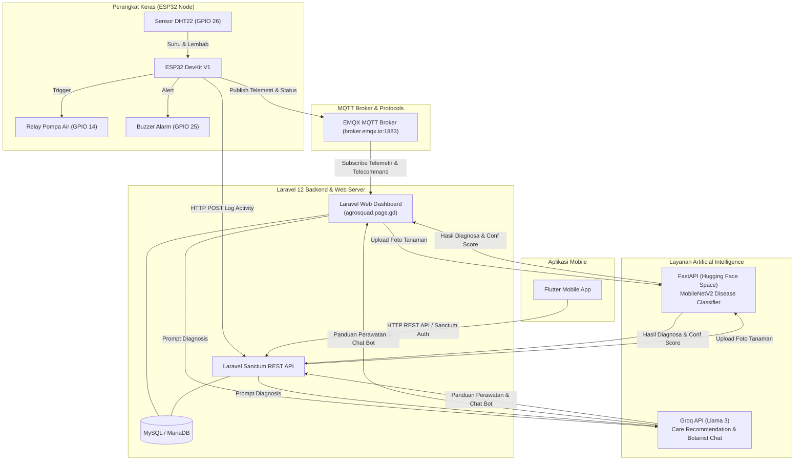

# 🌿 OLERICURE: Sistem Irigasi Presisi Berbasis IoT Hibrida & Diagnosis Patogen Daun Olerikultura Menggunakan Cloud-Based Inference MobileNetV2 Terintegrasi Large Language Model

[](https://laravel.com)
[](https://php.net)
[](https://espressif.com)
[](https://flutter.dev)
[](https://agrosquad.page.gd)
[](https://mqtt.org)
[](https://huggingface.co)
[](https://groq.com)
[](#)

**OLERICURE** adalah sistem cerdas hibrida berbasis *Internet of Things* (IoT) dan *Artificial Intelligence* (AI) yang dirancang khusus untuk pertanian olerikultura (budidaya tanaman hortikultura/sayuran). Sistem ini mengintegrasikan pengairan/irigasi presisi otomatis berbasis telemetri sensor dengan diagnosa penyakit daun secara *cloud-based inference* menggunakan arsitektur **MobileNetV2** serta rekomendasi perawatan tergeneratif menggunakan **Large Language Model (Groq Llama 3)**.

Ekosistem ini mencakup **Laravel 12 Web & REST API Backend**, mikrokontroler **ESP32 IoT Node**, model AI **Hugging Face (FastAPI)** + **Groq Llama 3**, serta **Aplikasi Mobile (Flutter)**.

---

## 🔗 Ekosistem Repository & Link Terkait

Sistem OLERICURE dikembangkan secara terintegrasi dalam beberapa komponen repository dan tautan server:

* 🌐 **Live Website Production:**  
  [`https://agrosquad.page.gd`](https://agrosquad.page.gd)
* 💻 **Web Server & Backend REST API Repository (Repo Ini):**  
  [`https://github.com/Lesmana24/Olericure`](https://github.com/Lesmana24/Olericure)
* 📱 **Aplikasi Mobile Repository (Flutter App):**  
  [`https://github.com/Lesmana24/Proyek3-Mobile/tree/main`](https://github.com/Lesmana24/Proyek3-Mobile/tree/main) *(Saran Rename: `olericure-mobile`)*
* 🧠 **AI Diagnostics Microservice (FastAPI on Hugging Face):**  
  [`https://lesmana24-agrosquad-ai.hf.space/diagnosa`](https://lesmana24-agrosquad-ai.hf.space/diagnosa)

---

## 📸 Antarmuka & Dokumentasi Visual

### 1. Dashboard Monitoring Real-Time
Memantau telemetri suhu (°C), kelembapan (%), status koneksi alat (Online/Offline), serta kontrol tombol penyiraman manual.


### 2. Diagnosis Patogen Daun & AI Care Guide (MobileNetV2 + LLM)
Hasil pemindaian kesehatan daun olerikultura berbasis arsitektur MobileNetV2, tingkat akurasi (confidence score), serta panduan perawatan tergeneratif berbasis Groq Llama 3 LLM.


### 3. Implementasi Perangkat Keras (IoT Node)
Rangkaian mikrokontroler ESP32 DevKit V1, sensor DHT22, modul relay 1-channel, dan alarm buzzer dalam wadah pelindung outdoor.


### 4. Riwayat Penyiraman & Notifikasi Sistem
Log riwayat aktivitas penyiraman otomatis (pemicu sensor vs pemicu jadwal mingguan) serta notifikasi peringatan status perangkat.


---

## 🏗️ Arsitektur Sistem & Alur Data



---

## 🔥 Fitur Utama System

### 🌐 1. Dashboard Web & Backend (Laravel 12)
* **Real-time Telemetry:** Dashboard interaktif memantau data suhu (°C) dan kelembapan (%) secara *live*.
* **Status Perangkat Otomatis:** Deteksi otomatis jika perangkat ESP32 mati atau terputus koneksi (Indikator Online/Offline).
* **Kontrol Threshold Dinamis:** Pengguna dapat menyesuaikan batas pemicu penyiraman (Suhu Tinggi & Kelembapan Kering) langsung dari Web/Mobile tanpa perlu *re-flash* firmware ESP32.
* **Smart Scheduling:** Jadwal penyiraman otomatis berdasarkan kombinasi hari (Senin-Minggu) dan jam tertentu.
* **Log History & Analytics:** Catatan lengkap aktivitas penyiraman (pemicu sensor vs pemicu jadwal) dengan opsi pembersihan/reset log.

### 📱 2. Integrasi Mobile App (Laravel Sanctum REST API)
* **Authentication API:** Endpoint Register & Login berbasis Token Sanctum yang aman (`/api/register`, `/api/login`, `/api/logout`).
* **Settings & Telemetry API:** Endpoint sinkronisasi pengaturan ambang batas dan status sensor untuk aplikasi mobile (`/api/settings`, `/api/update-setting`).
* **AI Scan & Chat API:** Mendukung pengambilan foto dari kamera HP untuk pemindaian penyakit tanaman dan percakapan AI (*Botanist Chatbot*) secara langsung dari mobile app (`/api/ai/upload`, `/api/mobile-chat`, `/api/ai/history`).

### 🧠 3. Pemindai Tanaman AI (MobileNetV2) & Chat Botanist (LLM)
* **MobileNetV2 Computer Vision Classifier:** Mengunggah gambar daun/tanaman ke mikroservis FastAPI Hugging Face (`lesmana24-agrosquad-ai.hf.space`) berbasis arsitektur **MobileNetV2** untuk mengidentifikasi patogen/penyakit daun olerikultura dengan tingkat akurasi tinggi.
* **Generative Plant Care Guide (Groq Llama 3):** Menghasilkan panduan perawatan yang disesuaikan secara dinamis meliputi kebutuhan cahaya, penyiraman, kisaran suhu ideal, serta daftar solusi penanganan masalah.
* **Interactive Botanist Chatbot:** Fitur konsultasi interaktif berbasis LLM yang siap menjawab pertanyaan spesifik pengguna mengenai kesehatan tanaman.

### 🤖 4. Logika Firmware Hardware (ESP32)
* **Compound Condition Logic:** Penyiraman otomatis diaktifkan hanya jika kondisi kritis terpenuhi (**Suhu > Threshold** DAN **Kelembapan < Threshold**).
* **Dynamic WiFi Config (`WiFiManager`):** Pengaturan koneksi WiFi tanpa *hardcode*. Jika koneksi terputus, ESP32 menyediakan Captive Portal AP (`IoT-Penyiraman-Config`) untuk konfigurasi via Smartphone.
* **MQTT Telecommand & OTA Update:** Menerima perintah *threshold* dan perubahan jadwal secara *real-time* via broker EMQX.
* **Fail-Safe Protection:** Timer pengaman otomatis mematikan relay pompa untuk mencegah kebocoran atau kerusakan akibat pompa menyala tanpa henti.

---

## 🛠️ Spesifikasi Teknis & Mapping Pinout

### Software Stack
| Layer | Teknologi / Library |
| :--- | :--- |
| **Live Production Server** | `https://agrosquad.page.gd` |
| **Backend Framework** | Laravel 12.x (PHP 8.2+) |
| **API Auth** | Laravel Sanctum |
| **Database** | MySQL 8.0 / MariaDB 10.4+ |
| **Frontend Web** | Blade, Tailwind CSS, Vite, Flowbite / Alpine.js |
| **AI Computer Vision** | MobileNetV2 Architecture, Python FastAPI, PyTorch (Hugging Face Space) |
| **AI Generative / LLM** | Groq API (Llama-3-70b/8b) |
| **IoT Protocol** | MQTT (PubSubClient), HTTP/HTTPS REST API |
| **Mobile App** | Flutter (Dart) |

### Pinout Hardware (ESP32 DevKit V1)
| Komponen | Jenis | Pin GPIO | Mode / Keterangan |
| :--- | :--- | :--- | :--- |
| **Sensor DHT22** | Input | `GPIO 26` | Pembacaan Suhu (°C) & Kelembapan (%) |
| **Modul Relay Pompa** | Output | `GPIO 14` | Trigger Pompa Air (*Active LOW*) |
| **Buzzer Alarm** | Output | `GPIO 25` | Indikator Suara Saat Penyiraman Aktif |
| **Tombol Reset WiFi** | Input | `GPIO 0` (BOOT) | Tahan saat boot untuk reset WiFiManager |

### Pemetaan Topik MQTT (`broker.emqx.io:1883`)
| Topik | Direction | Fungsi |
| :--- | :--- | :--- |
| `AgroSquad/monitoring/suhu` | Publish (ESP32 -> Server) | Data Telemetri Suhu Terbaru |
| `AgroSquad/monitoring/lembab` | Publish (ESP32 -> Server) | Data Telemetri Kelembapan Terbaru |
| `AgroSquad/outputpompa` | Publish (ESP32 -> Server) | Status Real-time Relay Pompa (ON/OFF) |
| `AgroSquad/kontrol/batas_suhu` | Subscribe (Server -> ESP32) | Ambang Batas Pemicu Suhu |
| `AgroSquad/kontrol/batas_lembab` | Subscribe (Server -> ESP32) | Ambang Batas Pemicu Kelembapan |
| `AgroSquad/kontrol/jadwal_mingguan` | Subscribe (Server -> ESP32) | Konfigurasi Hari & Jam Jadwal |

---

## 🚀 Panduan Instalasi Web & REST API Server

### Prasyarat System
* PHP versi 8.2 atau lebih baru (dengan ekstensi `pdo_mysql`, `curl`, `mbstring`, `openssl`).
* Composer (v2.x).
* Node.js (v18.x atau v20.x) & NPM.
* Server Database MySQL / MariaDB.

### Langkah-langkah Instalasi

1. **Clone Repository:**
   ```bash
   git clone https://github.com/Lesmana24/Olericure.git
   cd Olericure
   ```

2. **Install Dependensi Backend & Frontend:**
   ```bash
   composer install
   npm install
   ```

3. **Konfigurasi Environment:**
   Salin `.env.example` menjadi `.env` dan atur kredensial database serta API key:
   ```bash
   cp .env.example .env
   php artisan key:generate
   ```

   *Buka file `.env` dan sesuaikan variabel berikut:*
   ```env
   DB_CONNECTION=mysql
   DB_HOST=127.0.0.1
   DB_PORT=3306
   DB_DATABASE=web_proyek3
   DB_USERNAME=root
   DB_PASSWORD=

   # API Key Groq (Untuk Fitur AI Botanist & Care Guide)
   GROQ_API_KEY=your_groq_api_key_here
   ```

4. **Jalankan Migrasi Database:**
   ```bash
   php artisan migrate
   ```

5. **Build Asset Frontend:**
   ```bash
   npm run build
   ```
   *(Untuk pengembangan frontend dengan hot-reload, gunakan `npm run dev`)*

6. **Jalankan Development Server:**
   ```bash
   php artisan serve
   ```
   Akses aplikasi web di peramban Anda melalui: `http://127.0.0.1:8000` (atau kunjungi server production di `https://agrosquad.page.gd`).

---

## 🔌 Setup Firmware Hardware (ESP32)

1. Buka file firmware di [`/Hardware/code.ino`](./Hardware/code.ino) menggunakan **Arduino IDE**.
2. Pastikan pustaka (*libraries*) berikut telah terinstall via *Library Manager*:
   - `WiFiManager` (by tzapu)
   - `PubSubClient` (by Nick O'Leary)
   - `DHT sensor library` (by Adafruit)
   - `Adafruit Unified Sensor`
3. Sesuaikan URL API backend Laravel pada variabel `serverName` jika sudah di-deploy ke server production:
   ```cpp
   String serverName = "https://agrosquad.page.gd/api/simpan-notif";
   ```
4. Upload program ke board **ESP32 DevKit V1**.

### 📱 Cara Konfigurasi WiFi Pertama Kali:
1. Saat ESP32 dinyalakan pertama kali (atau tidak menemukan WiFi yang tersimpan), ESP32 akan masuk ke mode Access Point.
2. Hubungkan HP/Laptop ke WiFi AP bernama: **`IoT-Penyiraman-Config`**.
3. Halaman Captive Portal "*Configure WiFi*" akan terbuka secara otomatis.
4. Pilih SSID WiFi lokal Anda, masukkan password, lalu simpan (*Save*).
5. ESP32 akan restart dan terhubung otomatis ke jaringan.

---

## 📡 Ringkasan API Endpoints (Mobile & Hardware)

| Method | Endpoint | Auth | Deskripsi |
| :--- | :--- | :--- | :--- |
| `POST` | `/api/register` | Public | Registrasi akun baru pengguna mobile |
| `POST` | `/api/login` | Public | Authentikasi login & generate Sanctum Bearer Token |
| `POST` | `/api/logout` | Sanctum | Revoke token autentikasi pengguna |
| `GET` | `/api/settings` | Sanctum | Mengambil konfigurasi ambang batas & jadwal |
| `POST` | `/api/update-setting` | Sanctum | Memperbarui batas suhu/kelembapan via mobile |
| `GET` | `/api/notifications` | Sanctum | Mengambil daftar notifikasi penyiraman |
| `DELETE`| `/api/notifications/clear` | Sanctum | Menghapus seluruh riwayat notifikasi |
| `POST` | `/api/ai/upload` | Sanctum | Mengunggah foto tanaman & proses diagnosa AI |
| `POST` | `/api/store` | Sanctum | Menyimpan hasil diagnosa AI ke riwayat |
| `POST` | `/api/mobile-chat` | Sanctum | Percakapan interaktif dengan AI Botanist |
| `GET` | `/api/ai/history` | Sanctum | Mengambil daftar riwayat hasil diagnosa tanaman |
| `DELETE`| `/api/ai/history/{id}`| Sanctum | Menghapus entri riwayat diagnosa tanaman |
| `POST` | `/api/simpan-notif` | Public/HW | Endpoint penerimaan log penyiraman dari ESP32 |

---

## ☁️ Catatan Deployment & Shared Hosting

Aplikasi ini telah dioptimalkan untuk dapat berjalan lancar di lingkungan **Shared Hosting** (`agrosquad.page.gd` / aaPanel / InfinityFree / Railway / cPanel) tanpa memerlukan akses SSH root:
* **Clear Cache Utility:** Akses route `/clear-cache` di browser (`https://agrosquad.page.gd/clear-cache`) untuk melakukan pembersihan cache konfigurasi dan view secara otomatis tanpa terminal.
* **Direct Upload Storage Support:** Mendukung akses gambar via `/uploads/{path}` dan fallback `/storage/{path}` yang bekerja 100% tanpa memerlukan *symlink* `php artisan storage:link`.

---

## 👨‍💻 Tim Pengembang (Developers)

Proyek ini dikembangkan oleh Tim Pengembang Mahasiswa D3 Teknik Informatika - **Politeknik Negeri Indramayu (Polindra)** untuk Mata Kuliah **Proyek 3**:

* **Lesmana Adhi Kusuma**
* **Genetica Deardi I**
* **Muhammad Nurfaqiih**

---
*Distributed under the MIT License. See `LICENSE` for more information.*
